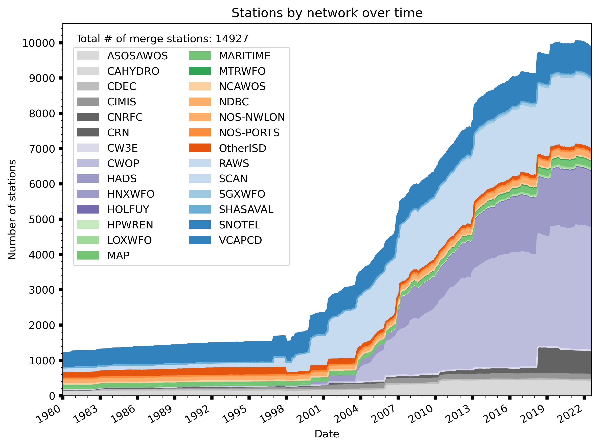

# Historical Observations Data Platform 
[](https://www.gnu.org/licenses/gpl-3.0)
[](https://github.com/psf/black)

**Code for Eagle Rock Analytics' cloud-based, historical weather observations data platform**

The [Historical Observations Data Platform](https://eaglerockanalytics.com/project/historical-observations-data-platform/) is a cloud-based, historical weather observations data platform to enable California's energy sector access to high-quality, open climate and weather data. This work is supported by California Energy Commission grant PIR-19-006. This repository contains the code (via Python scripts and Jupyter Notebooks) associated with the full processing pipeline for data ingestion into the Historical Data Platform.

The Platform responds to community partner needs in understanding weather and cliamte information including the severity, duration, frequency, and rate of change over time of extreme weather events, as well as supporting projections downscaling efforts. We implement stringent, customized Quality Assurance/Quality Control (QA/QC) procedures in line with international convention, and updates relevant to the energy sector are accurately captures (such as temperature and precipitation extremes, winds, and solar radiation). 

> [!WARNING]
> This project is still is under active development.

## 📊 About the data 
The Platform has sourced station data from from 27 publicly available historical data observation networks across the Western Electricity Coordinating Council (WECC) domain from 1980-2022 (time period varies between networks and stations). **14,927 stations** total have completed the full quality control and standardization pipelines and are publically available as [cloud-optimized zarrs](https://zarr.dev/) in [Amazon s3 storage](https://cadcat.s3.amazonaws.com/index.html#histwxstns/). 



---

## 🗂 Repository Structure

```text
historical-obs-platform/
├── data/                      # Miscellaneous supporting data
├── environment/               # Files for building the computational environment, including a README with further instructions
├── figures/                   # Visualizations
├── notebooks/                 # Jupyter notebooks for data visualization and analysis 
├── scripts/                   # Data processing code for all steps of the QAQC process 
│   ├── 1_pull_data/           # Scripts for retrieving/scrape network station data from their respective sources 
│   ├── 2_clean_data/          # Scripts for cleaning individual networks to a consistent standard
│   ├── 3_qaqc_data/           # Scripts to QA/QC stations 
│   ├── 4_merge_data/          # Scripts to close out processing, and standardize to hourly timesteps. Data at conclusion have been fully processed.
│   ├── misc/                  # Scripts that don't fit into any other categories
│   ├── pcluster/              # Code and shell scripts for running QAQC and merge scripts in an AWS pcluster environment 
│   └── tests/                 # Scripts for testing finalized data products
└──    
```

## 🛠️ Computational Environment 

See the [environment](https://github.com/Eagle-Rock-Analytics/historical-obs-platform/tree/main/environment) folder for instructions and files for building the computational environment for this project. 

## 🔏 License

This project is licensed under the GNU GPLv3 - see the [LICENSE](LICENSE) file for details.

## 🙋 Support

- 📧 **Email**: [info@eaglerockanalytics.com](mailto:info@eaglerockanalytics.com)
- 🐛 **Issues**: [GitHub Issues](https://github.com/Eagle-Rock-Analytics/historical-obs-platform/issues)

## 🧑‍💻 Contributors

[](https://github.com/Eagle-Rock-Analytics/historical-obs-platform/graphs/contributors)
